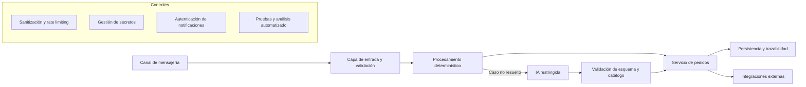

# Chatbot de pedidos con IA y controles de seguridad

Proyecto público en **Node.js** orientado a automatizar la recepción de pedidos de una hamburguesería mediante mensajería, integraciones externas y un fallback de IA restringido.

> **Estado:** proyecto aplicado en evolución y entorno controlado. No representa un servicio productivo activo ni debe utilizarse con credenciales, pagos o datos personales reales sin una validación operativa independiente.

## Objetivo

Demostrar cómo automatizar un proceso de negocio sin delegar decisiones sensibles directamente a un modelo de IA.

El proyecto evidencia:

- arquitectura modular y separación de responsabilidades;
- validación de entradas y reglas de negocio;
- persistencia y trazabilidad;
- seguridad de webhooks e integraciones;
- uso controlado de IA;
- pruebas automatizadas;
- CI y prácticas DevSecOps;
- documentación de riesgos y límites operativos.

## Arquitectura conceptual sanitizada



El diagrama es deliberadamente conceptual. No representa un despliegue real, dominios, cuentas, rutas administrativas, credenciales, datos comerciales ni topología productiva.

## Controles implementados

### Entradas y abuso

- sanitización de mensajes;
- límites configurables de longitud;
- rate limiting y bloqueo temporal;
- validación de esquemas y rechazo de datos inesperados;
- reglas de negocio ejecutadas por la aplicación.

### Uso seguro de IA

La IA funciona únicamente como fallback cuando el procesamiento determinístico no resuelve el mensaje.

- salida estructurada mediante esquema estricto;
- umbral mínimo de confianza;
- verificación posterior contra datos confiables;
- allowlist de intenciones permitidas;
- rechazo de productos inexistentes o ambiguos;
- bloqueo de confirmaciones, cancelaciones y otras acciones sensibles;
- separación entre interpretación del lenguaje y ejecución de operaciones.

### Webhooks e integraciones

- creación de operaciones desde lógica controlada del backend;
- autenticación criptográfica de notificaciones;
- comparación de firmas resistente a diferencias de tiempo;
- validación de referencias y estados antes de modificar pedidos;
- modo simulado para desarrollo;
- separación entre prueba y operación real.

### Secretos, datos y observabilidad

- configuración externa mediante variables de entorno;
- validación de parámetros obligatorios al iniciar;
- exclusión de secretos, sesiones, bases locales, logs y backups del repositorio;
- logging estructurado;
- health checks en entorno controlado;
- cierre controlado ante errores críticos.

## DevSecOps y cadena de suministro

El repositorio ejecuta controles automáticos en GitHub Actions:

- instalación reproducible con lockfile;
- pruebas automatizadas;
- auditoría de dependencias de producción;
- CodeQL para análisis estático;
- Gitleaks sobre el historial del repositorio;
- Trivy para secretos, configuración y vulnerabilidades;
- generación de SBOM CycloneDX;
- checksums y publicación temporal de evidencia de seguridad;
- acciones de CI fijadas por commit.

## Pruebas

La suite cubre escenarios funcionales y negativos, entre ellos:

- el fallback de IA no se usa cuando el parser determinístico comprende el mensaje;
- la IA no puede inventar productos;
- las respuestas de baja confianza se rechazan;
- las acciones sensibles permanecen bloqueadas;
- las formas de pago y estados se normalizan y validan;
- los cambios de pedido se verifican mediante casos automatizados.

```bash
npm ci
npm test
```

## Ejecución local segura

Requisitos:

- Node.js compatible con el proyecto;
- npm;
- credenciales únicamente de prueba para integraciones autorizadas.

```bash
git clone https://github.com/Dante2617012022/chatbot-hamburgueseria-v3.git
cd chatbot-hamburgueseria-v3
npm ci
cp .env.example .env
npm run dev
```

Las integraciones externas deben permanecer desactivadas o en modo de prueba hasta completar su configuración y validación.

## Modelo de amenazas resumido

| Riesgo | Tratamiento aplicado |
|---|---|
| Entrada maliciosa o abuso de mensajes | Sanitización, límites, validación y rate limiting |
| Respuesta insegura de IA | Esquemas, umbral de confianza, allowlist y validación posterior |
| Acción sensible ejecutada por IA | Separación de responsabilidades y bloqueo explícito |
| Notificación externa falsificada | Autenticación criptográfica y validación de referencias |
| Secreto incorporado al código | Configuración externa, Gitleaks y revisión automatizada |
| Dependencia vulnerable | Auditoría, Trivy, CodeQL y SBOM |
| Pérdida de trazabilidad | Persistencia, logging estructurado y pruebas |

El detalle de hallazgos abiertos, excepciones, datos reales y procedimientos operativos permanece fuera del repositorio público.

## Privacidad y divulgación responsable

El proyecto puede procesar identificadores de contacto, contenido de pedidos y datos asociados a integraciones. En este repositorio:

- se utilizan ejemplos y placeholders;
- no se publican credenciales, sesiones ni datos reales;
- no se documentan dominios, rutas privadas ni configuraciones productivas;
- no se publica una lista accionable de defensas ausentes;
- las pruebas deben ejecutarse solamente con cuentas y datos autorizados.

Los reportes de seguridad no deben abrirse como issues públicos. Consultá [SECURITY.md](SECURITY.md).

## Estado y límites

El sistema continúa en evolución. La preparación para un uso real requiere validación dinámica, revisión de privacidad, observabilidad, continuidad y pruebas de integración autorizadas. Los detalles operativos y riesgos residuales se mantienen en documentación privada.

## Competencias demostradas

- JavaScript y Node.js;
- arquitectura modular;
- seguridad de APIs e integraciones;
- validación de entradas y reglas de negocio;
- seguridad de webhooks;
- gestión de secretos;
- rate limiting y logging;
- IA controlada y validación estructurada;
- pruebas automatizadas;
- GitHub Actions, CodeQL, Gitleaks, Trivy y SBOM;
- documentación técnica y análisis de riesgos.

## Alcance ético

Este repositorio se publica con fines educativos, de evaluación técnica y mejora de un proceso propio. No autoriza el uso de credenciales, cuentas, números telefónicos, datos personales ni infraestructura de terceros sin consentimiento.

## Autor

**Dante Gabriel Balbuena Atar**  
Técnico en Ciberseguridad orientado a oportunidades junior en SOC, AppSec y DevSecOps, con experiencia previa en soporte técnico, telecomunicaciones y gestión de incidentes.
