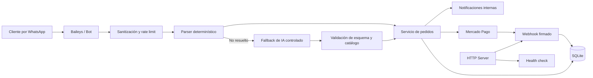

# Chatbot de pedidos con IA y controles de seguridad

Sistema modular en **Node.js** para automatizar la toma de pedidos de una hamburguesería mediante WhatsApp. El proyecto integra gestión de carrito, validación contra catálogo, persistencia en SQLite, pagos con Mercado Pago y un fallback de IA limitado por reglas de seguridad.

> **Estado:** proyecto en evolución y entorno de preproducción. No debe utilizarse con credenciales, pagos o datos personales reales sin completar el hardening, las pruebas de integración y la revisión operativa indicados en este documento.

## Objetivo

Construir una solución mantenible para reducir tareas manuales en la recepción de pedidos, sin delegar decisiones sensibles directamente a un modelo de IA.

El proyecto busca demostrar:

- Diseño modular y separación de responsabilidades.
- Automatización de un proceso operativo real.
- Validación de entradas y control de abuso.
- Gestión de secretos mediante variables de entorno.
- Verificación criptográfica de webhooks de pago.
- Uso controlado de IA con validación de esquema, umbral de confianza y bloqueo de acciones sensibles.
- Persistencia, trazabilidad y pruebas automatizadas.

## Arquitectura de alto nivel



## Componentes principales

```text
src/
├── admin/          autenticación y comandos administrativos
├── ai/             parser, esquemas, fallback de IA y tipos de intención
├── bot/            conexión con WhatsApp y manejo de mensajes
├── business/       horarios y disponibilidad del negocio
├── config/         carga y validación de variables de entorno
├── delivery/       zonas y reglas de entrega
├── menu/           catálogo, búsqueda y matching de productos
├── notifications/  generación y despacho de notificaciones
├── orders/          carrito, estados y flujo del pedido
├── payments/        integración y seguridad de Mercado Pago
├── security/        sanitización de entrada y rate limiting
├── server/          servidor HTTP, health check y webhooks
├── storage/         SQLite, sesiones y repositorios
└── utils/           logging y utilidades compartidas
```

## Controles de seguridad implementados

### Configuración y secretos

- Carga de configuración mediante `.env`.
- Validación de variables obligatorias al iniciar.
- Reglas adicionales para entornos de producción.
- Bloqueo del modo de pagos simulados en producción.
- Firma de webhook obligatoria en producción.
- Rate limiting obligatorio en producción.
- Exclusión de `.env`, sesiones de WhatsApp, logs, backups y bases locales mediante `.gitignore`.

### Seguridad de webhooks

- Validación de la firma de Mercado Pago mediante HMAC SHA-256.
- Comparación de firmas con `timingSafeEqual` para reducir riesgos de ataques por temporización.
- Rechazo de solicitudes con encabezados, identificadores o firmas inválidas.
- Respuestas de error sin exponer detalles internos sensibles.

### Entradas y disponibilidad

- Eliminación de caracteres de control.
- Límite configurable de longitud de mensajes.
- Rate limiting por cliente con persistencia en SQLite.
- Bloqueo temporal al superar el umbral configurado.
- Limpieza periódica de eventos antiguos de rate limit.

### Uso seguro de IA

La IA funciona únicamente como fallback cuando el parser determinístico no puede resolver el mensaje.

- Salida estructurada con JSON Schema estricto.
- Umbral mínimo de confianza configurable.
- Validación posterior con esquemas internos.
- Verificación de productos contra el catálogo real.
- Rechazo de productos inexistentes o ambiguos.
- Lista explícita de intenciones permitidas.
- Bloqueo de confirmación y cancelación automática de pedidos.
- Bloqueo de otras acciones sensibles que requieren lógica determinística o confirmación adicional.

### Observabilidad

- Logging estructurado con Pino.
- Health check con verificación de conectividad a SQLite.
- Registro de errores fatales y cierre controlado del proceso.
- Registro de eventos de mensajes y entradas no reconocidas para análisis y mejora.

## Casos de seguridad cubiertos por pruebas

La suite automatizada incluye, entre otros escenarios:

- El fallback de IA no se utiliza cuando el parser normal ya comprendió el mensaje.
- La IA no puede inventar productos inexistentes.
- Las respuestas con baja confianza se rechazan.
- La IA no puede confirmar pedidos.
- La IA no puede cancelar pedidos.
- Las formas de pago se normalizan y validan.
- Las modificaciones, eliminaciones y expresiones naturales del cliente se prueban mediante múltiples lotes de casos.

Ejecutar pruebas:

```bash
npm test
```

## Instalación local

### Requisitos

- Node.js compatible con las dependencias del proyecto.
- npm.
- SQLite local.
- Cuenta y credenciales de los servicios externos solamente para pruebas autorizadas.

### Preparación

```bash
git clone https://github.com/Dante2617012022/chatbot-hamburgueseria-v3.git
cd chatbot-hamburgueseria-v3
npm install
cp .env.example .env
```

Configurar como mínimo las variables indicadas en `.env.example`. Para una ejecución local sin WhatsApp, IA ni pagos reales, mantener desactivadas esas integraciones.

### Ejecución

```bash
npm run dev
```

Health check:

```bash
npm run health
```

## Variables de entorno relevantes

| Variable | Propósito |
|---|---|
| `NODE_ENV` | Entorno de ejecución. |
| `DATABASE_PATH` | Ruta de la base SQLite. |
| `MENU_PATH` | Ruta del catálogo de productos. |
| `OWNER_PHONE` | Número del responsable operativo. |
| `ADMIN_PHONES` | Lista de números autorizados para acciones administrativas. |
| `ENABLE_WHATSAPP` | Habilita la conexión con WhatsApp. |
| `ENABLE_AI_FALLBACK` | Habilita el fallback de IA. |
| `OPENAI_API_KEY` | Secreto del proveedor de IA. No debe versionarse. |
| `MERCADOPAGO_ACCESS_TOKEN` | Token de Mercado Pago. No debe versionarse. |
| `MERCADOPAGO_WEBHOOK_SECRET` | Secreto utilizado para validar webhooks. |
| `MERCADOPAGO_REQUIRE_WEBHOOK_SIGNATURE` | Exige firma válida en el webhook. |
| `RATE_LIMIT_ENABLED` | Activa el control de frecuencia por cliente. |
| `MAX_MESSAGE_LENGTH` | Longitud máxima aceptada por mensaje. |
| `DEV_ENDPOINT_TOKEN` | Protege endpoints auxiliares de desarrollo. |

## Modelo de amenazas resumido

| Riesgo | Control actual | Riesgo residual / mejora pendiente |
|---|---|---|
| Exposición de secretos | `.env`, validación y `.gitignore` | Incorporar secret scanning automático y rotación documentada. |
| Webhook de pago falsificado | HMAC y comparación constante | Agregar defensa contra replay y pruebas de integración con el proveedor. |
| Abuso o spam | Rate limit y bloqueo temporal | Aplicar límites específicos también en la capa HTTP. |
| Prompt injection o respuesta insegura de IA | Schema estricto, allowlist de intenciones y validación contra catálogo | Redactar PII antes de enviar contenido y reforzar evaluación adversarial. |
| Confirmación incorrecta de pedidos | Intenciones sensibles bloqueadas para IA | Incorporar confirmación explícita y pruebas end-to-end. |
| Acceso a endpoints de desarrollo | Deshabilitados en producción y token opcional en desarrollo | Exigir token siempre que el servidor escuche fuera de localhost. |
| Pérdida o corrupción de datos | SQLite y scripts de backup | Definir cifrado, restauración probada y política de retención. |
| Exposición de datos personales en logs | Logging estructurado | Implementar redacción centralizada de PII y revisión de eventos. |

## Privacidad y tratamiento de datos

El flujo puede procesar número de teléfono, nombre, dirección, contenido del pedido y datos asociados al estado de pago. Antes de una operación real se requiere:

- Minimización de datos.
- Política de retención y eliminación automática.
- Redacción de PII en logs y solicitudes a servicios externos.
- Control de acceso administrativo.
- Backups protegidos y procedimiento de restauración.
- Aviso de privacidad acorde con la jurisdicción aplicable.

## Mejoras planificadas

- CI con ejecución automática de pruebas.
- CodeQL, análisis de dependencias y secret scanning.
- Headers HTTP de seguridad y rate limiting específico para endpoints.
- Protección contra replay en webhooks.
- Timeouts y cancelación explícita para servicios externos.
- Redacción centralizada de PII.
- Métricas operativas y alertas.
- Pruebas de integración y end-to-end.
- Dockerización y guía de despliegue endurecido.
- Documentación de recuperación ante fallos.

## Competencias demostradas

- JavaScript y Node.js.
- Arquitectura modular.
- Integración de APIs.
- Gestión de estados y persistencia con SQLite.
- Validación de entradas.
- Seguridad de webhooks.
- Gestión de secretos.
- Rate limiting.
- Logging y health checks.
- Pruebas automatizadas.
- Diseño seguro de funciones basadas en IA.
- Documentación técnica y análisis de riesgos.

## Alcance ético

Este repositorio se publica con fines educativos, de evaluación técnica y mejora de un proceso propio. No autoriza el uso de credenciales, cuentas, números telefónicos o datos de terceros sin consentimiento.

## Autor

**Dante Gabriel Balbuena Atar**  
Estudiante avanzado de la Tecnicatura Universitaria en Ciberseguridad, con experiencia en telecomunicaciones, soporte técnico, gestión de incidentes y automatización.
